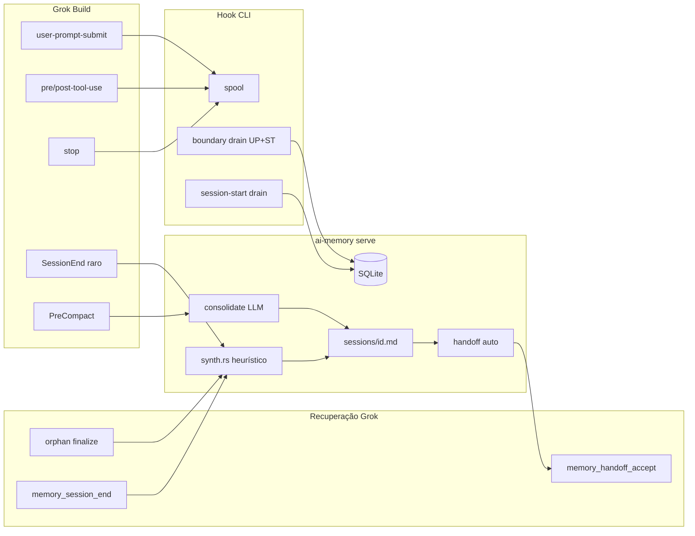

# Inventário Grok Build — Fase 2 (memórias funcionais)

Documento de trabalho para a **segunda fase**: corrigir o que deveriam ter sido
memórias funcionais do Grok Build (wiki legível, handoffs, consolidação).

**Snapshot:** 2026-06-19 (branch `fork`, servidor `~/.ai-memory`, SQLite
`memory.sqlite`).

**Marco do operador:** uso do Grok Build iniciado em **terça-feira 2026-06-16,
13:50 BRT**. O inventário abaixo usa esse instante como corte temporal.

**Documento relacionado:** [`diagnostico-grok-build-memoria.md`](diagnostico-grok-build-memoria.md)
(experimentos `/home`, `/exit`, bugs de drain/parser).

---

## Resumo executivo

| Métrica | Valor |
|---------|------:|
| Sessões `agent_kind=grok` **antes** do corte (16/06 13:50) | **0** |
| Sessões grok **desde** o corte | **16** |
| Sessões grok ainda **abertas** | **8** |
| Páginas wiki `sessions/<grok-session-id>.md` | **9** |
| Sessões grok **sem** página wiki | **7** |
| Handoffs com `from_agent=grok` | **8** (1 accepted, 3 open, 4 expired) |
| Observations grok (desde corte) | **5 087** |

**Lacuna 16–17/06:** nenhuma sessão tagueada `grok` no SQLite antes do corte.
A primeira sessão grok registrada é **2026-06-18 10:32 BRT** (`ee3a6f02…` /
`b428b5d9…`). Hipóteses: hooks ainda não instalados nos dois primeiros dias;
sessões sem `agent=grok` no POST; ou trabalho em outro harness (Cursor) no
mesmo período.

**Padrão dominante:** captura bruta de tools no SQLite funciona; memória
**legível** (wiki + handoff) só aparece quando algum caminho de **finalização**
roda — `SessionEnd` (raro), **orphan finalize** no `session-start` seguinte,
**PreCompact** (checkpoint LLM), ou **`memory_session_end`** (MCP manual).

---

## Catálogo de heurísticas Grok Build (código + comportamento)

Heurísticas são regras **determinísticas** ou **gatilhos condicionais** que o
ai-memory aplica especificamente (ou com impacto desproporcional) no Grok Build.

### 1. Identidade e flags do agente

| Heurística | Onde | Comportamento |
|------------|------|---------------|
| `AgentKind::Grok` | `crates/ai-memory-core/src/ids.rs` | Wire string `grok`; desconhecido → `Other`. |
| **Sem injeção de handoff no SessionStart** | `session_start_injects_handoff()` → `false` para Grok | Grok **ignora stdout** do hook SessionStart. Buscar handoff no hook **consumiria** o handoff (GET destrutivo) sem entregar contexto. Recuperação via MCP `memory_handoff_accept`. |
| **Orphan finalize no session-start** | `needs_orphan_finalize_on_session_start()` → `true` só Grok | No próximo `session-start` no **mesmo cwd**, finaliza sessões abertas cujo último evento foi `stop`. Compensa `/exit`/`/home` sem `SessionEnd`. |

### 2. Hook CLI — spool e drain

| Heurística | Onde | Comportamento |
|------------|------|---------------|
| Enfileiramento instantâneo | `hook.rs` + `hook_spool.rs` | Todo evento → JSON em `%LOCALAPPDATA%\ai-memory\hook-spool` (ou `--data-dir`). |
| Drain incremental | `should_incremental_drain` | Só em `post-tool-use` quando spool ≥ **32** (`DEFAULT_INCREMENTAL_THRESHOLD`), budget **250 ms**. |
| Drain em `session-start` | `hook.rs` | Limpa backlog da sessão anterior; **não** busca handoff no Grok. |
| Drain em `session-end` | `hook.rs` | Flush completo antes do POST de finalização (quando o harness dispara). |
| **Boundary drain Grok** | `boundary_drain_for_event` | `user-prompt-submit` → budget de start; `stop` → budget de end. Garante que prompt/tools cheguem ao SQLite sem esperar 32 posts nem `SessionEnd`. |
| **PreToolUse allow** | `hook_stdout_payload` | Grok bloqueante: imprime `{"decision":"allow"}` em `pre-tool-use`. `{}` falha no UI. |
| Dois data-dirs | hooks vs `serve` | Spool em LocalAppData; servidor/wiki/SQLite em `~/.ai-memory`. Não é split-brain — é pipeline write-ahead. |

### 3. Parser de eventos

| Heurística | Onde | Comportamento |
|------------|------|---------------|
| `user-prompt-submit` → `UserPrompt` | `payload.rs` | Aceita `user-prompt-submit` / `user_prompt_submit` (fix fork). Histórico antigo: muitos prompts classificados como `other` antes do fix. |
| `Stop` ≠ finalização | `router.rs` | `Stop` grava observation apenas. **Não** gera wiki, handoff, nem `end_session`. |
| `SessionEnd` = finalização completa | `router.rs` + `finalize.rs` | Synth página + `end_session` + handoff automático + commit wiki. Raro no Grok. |

### 4. Orphan finalize (servidor)

| Heurística | Onde | Comportamento |
|------------|------|---------------|
| Condição | `router.rs` ~639–674 | `SessionStart` + agente Grok + cwd conhecido → lista sessões abertas no mesmo projeto/cwd (exceto a atual). |
| Gatilho | `last_observation_kind == Stop` | Só finaliza se o último evento da órfã for `stop` (proxy de “sessão terminou no harness”). |
| Efeito | `finalize_open_session` | Mesmo pipeline que `SessionEnd`: synth + handoff. |
| **Não** finalizar em todo `Stop` | Decisão de desenho | `Stop` ocorre a cada turno — finalizar ali geraria falsos positivos. |

### 5. Síntese heurística de página (`synth.rs`)

Regra **sem LLM** usada em `SessionEnd`, orphan finalize e `memory_session_end`
(antes de consolidação opt-in):

| Regra | Detalhe |
|-------|---------|
| Caminho | `sessions/<session_id>.md`, `tier: episodic` |
| Título | Primeiro `user-prompt` com título; senão primeiro observation com título; senão `"session"`. |
| Corpo | Metadados, lista de prompts, contagem de tools (**só PostToolUse** — evita dobrar Pre+Post), raw observations (cap 500 linhas head/tail). |
| Rodapé | `_Synthesised by ai-memory (M3, no-LLM heuristic)._` |

### 6. Handoff automático (`finalize.rs` `build_auto_handoff`)

| Regra | Detalhe |
|-------|---------|
| Resumo | Primeiro e último `user-prompt` (cap 1500 chars); se só um prompt → “Session focused on: …”; sem prompts → “Session ended; N observations recorded.” |
| `open_questions` | “Continue from: …” com último prompt, se houver. |
| `next_steps` | Lista de tools (Pre+Post) usadas, se houver. |
| Estado | `open` até `memory_handoff_accept` ou expiração por handoff mais novo no mesmo escopo. |

### 7. PreCompact (checkpoint sem encerrar)

| Heurística | Onde | Comportamento |
|------------|------|---------------|
| Gatilho | `HookEvent::PreCompact` | **Não** encerra sessão; **não** cria handoff. |
| Com LLM | `consolidate_or_synth` | `consolidator.consolidate_session` → página com `consolidated: true`. |
| Sem LLM | fallback `synthesize_session_page` | Mesma heurística M3. |
| Sessão longa | PreCompact repetido | Página `sessions/<id>.md` **sobrescrita**; SessionEnd/MCP finalize supersede depois. |

### 8. MCP e escopo Grok

| Heurística | Onde | Comportamento |
|------------|------|---------------|
| **`memory_session_end`** | `server.rs` | Finalização manual: wiki + handoff; idempotente; `session_id` opcional via header MCP actor. |
| **Escopo explícito** | `AGENTS.md`, routing | Grok MCP **não** carrega `cwd`; chamadas sem `project` resolvem projeto errado → handoff null / briefing vazio. |
| Consolidação no fim | `AI_MEMORY_CONSOLIDATE_ON_SESSION_END` | Opt-in; espelha SessionEnd hook. Default **off**. |

### 9. Limitações do harness (não são heurísticas ai-memory, mas moldam o resultado)

| Limitação | Evidência | Mitigação ai-memory |
|-----------|-----------|---------------------|
| `/exit` e `/home` sem `SessionEnd` | Experimentos `Teste_grok` | Orphan finalize + `memory_session_end` |
| `Stop` = fim de **turno** (`reason: end_turn`) | `updates.jsonl` | Não tratar como fim de sessão |
| SessionStart stdout ignorado | Doc Grok `10-hooks.md` | MCP `memory_handoff_accept` com `project` |
| Memória nativa Grok `[memory]` | `config.toml` | Separada; não substitui wiki ai-memory |

---

## Observations por `kind` (grok, desde 2026-06-16 13:50)

| kind | count | Notas |
|------|------:|-------|
| pre-tool-use | 2 420 | Captura de tools OK |
| post-tool-use | 2 405 | Par com pre |
| stop | 113 | ~7 por sessão em média (fim de turno) |
| other | 98 | Legado pré-fix `user-prompt-submit` no parser |
| session-start | 28 | Inclui resume e sessões paralelas |
| **user-prompt** | **15** | Pós-fix boundary drain + parser |
| pre-compact | 14 | Checkpoints LLM em sessões longas |
| **session-end** | **4** | Só `utilitarios` (sessões ~2 s) |

---

## Inventário de sessões Grok

### Por projeto

| Projeto | Sessões | Abertas | Obs total | Com wiki | Com handoff |
|---------|--------:|--------:|----------:|:--------:|:-----------:|
| ai-memory | 2 | 1 | 1 847 | 1 | 1 (accepted) |
| utilitarios | 5 | 1 | 2 838 | 5 | 4 (expired) |
| Teste_grok | 5 | 2 | 27 | 3 | 3 (open) |
| consisanet | 2 | 2 | 207 | 0 | 0 |
| Grok_cp1252_mcp | 1 | 1 | 171 | 0 | 0 |
| DLL_ConsisaEmail | 1 | 1 | 7 | 0 | 0 |

### Tabela completa

| session_id (prefixo) | Projeto | Início (BRT) | Fim | Obs | session-end | user-prompt | Wiki | Handoff |
|----------------------|---------|--------------|-----|----:|:-----------:|:-----------:|:----:|:-------:|
| `ee3a6f02…` | DLL_ConsisaEmail | 2026-06-18 10:32 | — | 7 | 0 | 0 | ❌ | — |
| `b428b5d9…` | consisanet | 2026-06-18 10:32 | — | 4 | 0 | 0 | ❌ | — |
| **`019edaf8…`** | **ai-memory** | 2026-06-18 10:42 | 2026-06-19 15:19 | **1842** | 0 | 13 | ✅ LLM | **accepted** |
| **`019ed614…`** | utilitarios | 2026-06-18 10:44 | — | **2500** | 0 | 0 | ✅ LLM | ❌ |
| `019edb09…` (×2) | utilitarios | 2026-06-18 11:06 | 11:06 | 82–110 | 1 cada | 0 | ✅ LLM | expired |
| `46e96b1a…` | ai-memory | 2026-06-18 14:28 | — | 5 | 0 | 0 | ❌ | — |
| `019edbc5…` (×2) | utilitarios | 2026-06-18 14:28 | 14:28 | 70–76 | 1 cada | 0 | ✅ LLM | expired |
| `019ed70d…` | consisanet | 2026-06-18 15:42 | — | 203 | 0 | 0 | ❌ | — |
| `019ed6e3…` | Grok_cp1252_mcp | 2026-06-19 10:05 | — | 171 | 0 | 0 | ❌ | — |
| `019ee055…` | Teste_grok | 2026-06-19 11:43 | 14:25 | 3 | 0 | 0 | ✅ vazio | open |
| `019ee059…` | Teste_grok | 2026-06-19 11:47 | 14:26 | 3 | 0 | 0 | ✅ vazio | open |
| `019ee05d…` | Teste_grok | 2026-06-19 11:51 | 14:26 | 7 | 0 | 0 | ✅ tools | open |
| `019ee0ea…` | Teste_grok | 2026-06-19 14:25 | — | 7 | 0 | 1 | ❌ | — |
| `019ee0f8…` | Teste_grok | 2026-06-19 14:40 | — | 7 | 0 | 1 | ❌ | — |

**Sessão referência (fase 1):** `019edaf8-6f32-7482-add2-8a455430d5e0` — diagnóstico
Grok, implementação `memory_session_end`, routing MCP. Finalizada via MCP (~70 s);
página LLM de alta qualidade; handoff `019ee11b…` consumido em debug de escopo.

---

## Páginas wiki consolidadas (Grok)

Todas as páginas abaixo estão em `~/.ai-memory/wiki/.../sessions/<id>.md`.
**Todas** têm `consolidated: true` no frontmatter → produzidas por **PreCompact**
ou finalize com LLM disponível, **não** pelo texto cru do synth M3 sozinho.

### Páginas ligadas a session_id grok (9)

| session_id | Projeto | Título (frontmatter) | Bytes | Qualidade | Origem provável |
|------------|---------|----------------------|------:|-----------|-----------------|
| `019edaf8…` | ai-memory | ai-memory hooks, sessionEnd trigger… | 4 196 | **Alta** — 13 pedidos do usuário, contexto durável | `memory_session_end` + PreCompact LLM |
| `019ed614…` | utilitarios | Coding-agent session with lifecycle-only… | 1 097 | **Baixa** — “tool telemetry only”, sem payloads | PreCompact (sessão ainda aberta) |
| `019edb09…` ×2 | utilitarios | (lifecycle / tool counts) | ~800 | Baixa | SessionEnd hook + LLM |
| `019edbc5…` ×2 | utilitarios | (idem) | ~750 | Baixa | SessionEnd hook + LLM |
| `019ee055…` | Teste_grok | Empty session — no durable context | 323 | Nula (esperado) | Orphan finalize pós `/home` |
| `019ee059…` | Teste_grok | Empty session… | 338 | Nula | Orphan finalize pós `/exit` |
| `019ee05d…` | Teste_grok | (list files experiment) | 607 | Baixa | Orphan finalize |

### Páginas colaterais no projeto ai-memory (não são UUID de sessão grok)

Geradas por **orphan finalize** durante testes `Teste_grok` (IDs hash v5 de
payloads mínimos):

| path | Título | Notas |
|------|--------|-------|
| `sessions/dadff3b6….md` | stop | Uma observation `stop`; sem contexto |
| `sessions/1f3005e2….md` | rtk git status snapshot | Órfã com trabalho mínimo |
| `sessions/caa0fab2….md` | stop | Idem dadff3b6 |

Estas páginas **poluem** o projeto `ai-memory` — candidatas a revisão/arquivo na
fase 2.

---

## Handoffs originados em sessões Grok

| handoff_id (prefixo) | Estado | from_session | Projeto | Criado (BRT) |
|----------------------|--------|--------------|---------|--------------|
| `019ee11b…` | **accepted** | `019edaf8…` | ai-memory | 2026-06-19 15:19 |
| `019ee0eb…` | open | `019ee05d…` | Teste_grok | 2026-06-19 14:26 |
| `019ee0eb…` | open | `019ee059…` | Teste_grok | 2026-06-19 14:26 |
| `019ee0ea…` | open | `019ee055…` | Teste_grok | 2026-06-19 14:25 |
| `019edbc6…` ×2 | expired | `019edbc5…` | utilitarios | 2026-06-18 14:28 |
| `019edb0e…` ×2 | expired | `019edb09…` | utilitarios | 2026-06-18 11:06 |

**Ausências notáveis:**

- `019ed614…` (2500 obs, wiki LLM) — **sem handoff** (sessão ainda aberta).
- Sessões `consisanet`, `Grok_cp1252_mcp`, `DLL_ConsisaEmail` — sem finalize.
- `019ee0ea…` / `019ee0f8…` — observations + prompts, **sem** wiki nem handoff
  (aguardam próximo `session-start` no mesmo cwd ou `memory_session_end`).

---

## Análise de gaps (o que deveria ter sido memória funcional)

### Gap A — Período 16–17/06 sem sessões grok no SQLite

Trabalho real no Grok pode ter ocorrido sem hooks ou sem tag `agent=grok`.
**Parcialmente recuperável** cruzando `~/.grok/sessions/**/{chat_history,updates}.jsonl`
(como na remediação fase 2); spool arquivado em LocalAppData é complemento.

### Gap B — Sessões longas abertas sem handoff

| Sessão | Obs | Impacto |
|--------|----:|---------|
| `019ed614…` utilitarios | 2500 | Wiki PreCompact existe, mas **continuidade** (handoff) inexistente |
| `019ed70d…` consisanet | 203 | Zero wiki |
| `019ed6e3…` Grok_cp1252_mcp | 171 | Zero wiki |
| `019ee0ea…` / `019ee0f8…` Teste_grok | 7 cada | Testes de orphan/MCP pendentes de finalize |

### Gap C — Páginas de baixo sinal

Páginas “lifecycle-only” ou “Empty session” são **tecnicamente corretas** dado o
log, mas **inúteis** para retomada. Causas:

1. Prompts históricos em `other` (pré-fix parser).
2. Corpos vazios em observations de tool (hook captura nome, não sempre payload).
3. Finalize disparado cedo (orphan) com poucas observations drenadas.

### Gap D — Handoffs open de teste

3 handoffs `Teste_grok` open poluem `memory_handoff_accept` se o operador abrir
esse projeto. Candidatos a `memory_handoff_cancel` na fase 2.

### Gap E — MCP sem `project`

Handoff `019edaf9…` (sessão omp) foi consumido quando MCP estava sem escopo;
corrigido com routing explícito — não repetir.

---

## Mapa de gatilhos → memória funcional



---

## Remediação executada (2026-06-19)

Pipeline: [`scripts/windows/grok-remediation/`](../scripts/windows/grok-remediation/)
(`run_all.py` → `finalize_open_sessions.py` → `backfill_observations.py` →
`consolidate_remediated.py`).

| Etapa | Resultado |
|-------|-----------|
| Sessões Grok indexadas (filesystem) | **18** |
| Páginas wiki apagadas (`memory_delete_page`) | **14** |
| Sessões reescritas a partir de JSONL Grok | **7** (+ utilitarios reparado) |
| Handoffs archive promovidos | **19** em `decisions/handoff-archive-*.md` |
| Handoffs archive ignorados (dedup/vazio) | **5** (4 grok vazios + 1 pi-cursor-sdk curto) |
| Sessões SQLite finalizadas (`memory_session_end`) | **10** (0 grok abertas) |
| Observations backfilled do filesystem Grok | **3** sessões / **200** obs |
| Consolidação LLM (`memory_consolidate`) | **7/7** OK |

**Mantidas:** `019edaf8….md` (ai-memory).

**Reescritas (miner Grok):** `019ed614` utilitarios (**74 prompts** via `updates.jsonl`), `019ed70d` consisanet, `019ed6e3` Grok_cp1252_mcp, `019ed565` cpb-js, `019ed162`/`019ed15d` home, `019ee11d` ai-memory.

**Apagadas:** Teste_grok vazias, utilitarios ~2s, órfãs `dadff3b6`/`caa0fab2`/`1f3005e2`, página lifecycle-only de `019ed614` (substituída).

Logs: `target/grok-remediation/{summary,delete-log,write-log,handoff-promote}.jsonl`

### Finalização SQLite (`memory_session_end`)

Executado via [`finalize_open_sessions.py`](../scripts/windows/grok-remediation/finalize_open_sessions.py):

- **10** sessões abertas candidatas → todas com `ended_at` no SQLite (**0 grok abertas** restantes)
- **4** páginas remedidas restauradas após finalize (utilitarios, consisanet, Grok_cp1252_mcp, pedro.ailton) — evita sobrescrita heurística vazia
- Handoffs automáticos criados por sessão (ex. `019ee137…` utilitarios)
- Log: `target/grok-remediation/finalize-log.json`

### Backfill de observations (`backfill_observations.py`)

Três sessões reescritas pelo miner **não existiam no SQLite** (só no filesystem
Grok + wiki remedida). `memory_consolidate` exige observations + `current_body` —
não lê `~/.grok/sessions` diretamente.

Solução: [`backfill_observations.py`](../scripts/windows/grok-remediation/backfill_observations.py)
materializa observations sintéticas a partir do JSONL Grok:

| Fonte Grok | Observation `kind` |
|------------|-------------------|
| `summary.json` | `session-start`, `session-end` (timestamps reais) |
| `chat_history.jsonl` + `user_message_chunk` | `user-prompt` |
| `tool_call` / `tool_call_update` em `updates.jsonl` | `pre-tool-use` / `post-tool-use` (amostra ≤96) |

Marcadas com `extension=grok-remediation` + `source_event=filesystem-backfill`.
Cria também a linha `sessions` (`agent_kind=grok`, `ended_at` do `summary.json`).

| session_id | projeto | obs inseridas | prompts | tools amostrados |
|------------|---------|--------------:|--------:|-----------------:|
| `019ed565…` | cpb-js | 152 | 54 | 95 |
| `019ed15d…` | pedro.ailton | 37 | 2 | 33 |
| `019ee11d…` | ai-memory | 11 | 1 | 8 |

Log: `target/grok-remediation/backfill-log.json`

[`consolidate_remediated.py`](../scripts/windows/grok-remediation/consolidate_remediated.py)
chama o backfill automaticamente quando `observation_count == 0` antes de
`memory_consolidate`.

### Consolidação LLM (`memory_consolidate`)

Allowlist explícita; **exclui** `019e8375-411a-7ea6-8cbc-02781b3fb04a`.

**Primeira rodada (4/7):** sessões com observations de hook no SQLite consolidaram;
as três acima falharam com `has no observations`.

**Rodada final (7/7)** após backfill:

| session_id | projeto | título consolidado |
|------------|---------|-------------------|
| `019ed614…` | utilitarios | CPB Utilitarios: DCC32.CFG, Compilar Selecionados e delphi-files MCP |
| `019ed70d…` | consisanet | TICKET-375458: debug, fix validation, and explain commit e474d54 |
| `019ed6e3…` | Grok_cp1252_mcp | Grok CP1252 MCP: delphi-files, mcps folder, xAI feedback |
| `019ed162…` | pedro.ailton | Grok Build feedback channel and ai-memory hooks |
| `019ed565…` | cpb-js | cpb-js runtime seed e sandbox consisanet-copia |
| `019ed15d…` | pedro.ailton | Restore Cursor CLI 'agent' After Grok Builder PATH Conflict |
| `019ee11d…` | ai-memory | memory_handoff_accept session in ai-memory |

Logs: `target/grok-remediation/consolidate-log.json` (1ª rodada 4/7);
backfill + 2ª rodada documentados em `backfill-log.json`.

### Split + consolidação `019e8375…` (sessão pi consisanet)

Página heurística **~627 KB** / **11.841 observations** — fora do allowlist
original. Pipeline: [`split_consolidate_session.py`](../scripts/windows/grok-remediation/split_consolidate_session.py)
(5 chunks temáticos → sessões-filhas SQLite → `memory_consolidate` → `decisions/`).

| Chunk | Prompts | Obs | Página consolidada |
|-------|--------:|----:|-------------------|
| A | 1–34 | 2.165 | `decisions/DDS-386661-termo-horario-regressao.md` |
| B | 35–92 | 2.119 | `decisions/DDS-355705-monitor-comercial.md` |
| C | 93–148 | 3.022 | `decisions/TICKET-375458-darf-csll-urgencia.md` |
| D1 | 149–200 | 2.105 | `decisions/TICKET-390068-in-rfb-2305-implementacao.md` |
| D2 | 201–256 | 2.222 | `decisions/TICKET-390068-validacao-merge.md` |

Página pai `sessions/019e8375….md` substituída por **índice** com links às 5 páginas.
Sessões-filhas (`dc03c199…`, `aa651828…`, etc.) mantêm cópias em `sessions/<child>.md`.
Log: `target/grok-remediation/split-consolidate-log.json`

### Pendente opcional

| # | Ação | Notas |
|---|------|-------|
| 1 | Rotina operador | `memory_session_end` antes de `/exit` no Grok |

Limpeza pós-split (`split_consolidate_session.py --cleanup`): **5/5** páginas
`sessions/<child-id>.md` apagadas; **11.633** observations duplicadas e 5 sessões-filhas
removidas do SQLite. Páginas canônicas permanecem em `decisions/…` + índice na sessão pai.
Log: `target/grok-remediation/split-consolidate-cleanup-log.json`

---

## Como reproduzir este inventário

```powershell
python C:\GIT\ai-memory\target\inventory_grok_phase2.py > C:\GIT\ai-memory\target\inventory_grok_out.json
```

Script consulta `~/.ai-memory/db/memory.sqlite` e cruza com
`~/.ai-memory/wiki/**/sessions/*.md`. Corte: `1781628600000000` µs
(2026-06-16 13:50 BRT).

---

## Histórico do documento

| Data | Alteração |
|------|-----------|
| 2026-06-19 | Inventário inicial fase 2 — heurísticas, 16 sessões, 9 páginas, 8 handoffs |
| 2026-06-19 | Remediação executada — pipeline grok-remediation, 14 deletes, 7+1 writes, 19 handoffs promovidos |
| 2026-06-19 | Backfill observations do filesystem Grok + consolidação **7/7** (`backfill_observations.py`) |
| 2026-06-19 | Split + consolidação **5/5** da sessão `019e8375…` (`split_consolidate_session.py`) |